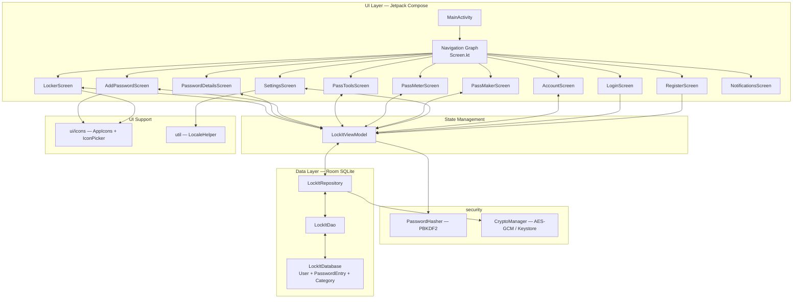
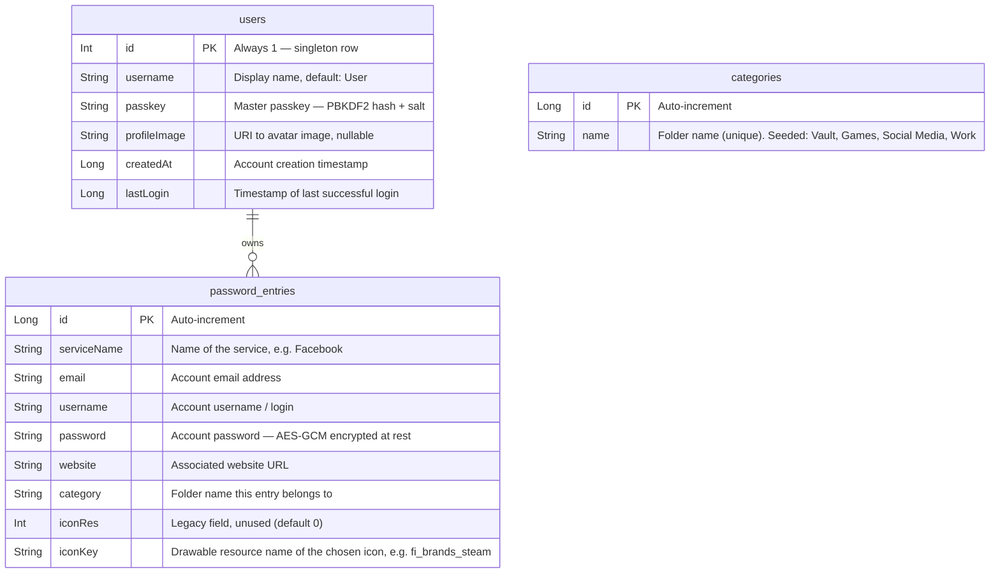

# 🔐 LockIt — Password Manager

[](#)
[](#)
[](#)
[](#)
[](#)

**LockIt** is a modern, offline-first password manager for Android. All credentials are stored locally on the device — no internet connection, no cloud, no risk. Built with Jetpack Compose, Room, and a clean MVVM architecture.

---

## ✨ Features

| Feature | Description |
| :--- | :--- |
| 🔒 **Secure Locker** | Store and manage account credentials (service, email, username, password, website) locally |
| 🗂️ **Custom Folders** | Create, rename and delete your own categories; file each login into a folder (persisted in Room) |
| 🎨 **Service Icons** | Assign a monochrome brand icon to any entry via a searchable picker (imported Flaticon "Uicons" vectors) |
| 👁️ **Blurred Reveal** | List passwords show a blurred decoy (never the real value); tap the eye to reveal, tap a revealed card for a details popup |
| 🗝️ **Master Passkey** | Single master password protects access to all stored entries — stored as a PBKDF2 hash, never in clear |
| 🔐 **Encrypted at Rest** | Saved passwords are encrypted with AES-256-GCM (key in the Android Keystore) |
| 🛠️ **PassTools** | Password strength meter (`PassMeter`) and a generator (`PassMaker`) with guaranteed minimum digits/symbols and copy-to-clipboard |
| 🌓 **Dynamic UI** | Full Light and Dark mode support, toggled from Settings |
| 📴 **Privacy First** | 100% on-device storage — no network calls, no data sharing |
| 🌐 **Multilingual** | English and Polish, switchable at runtime from Settings (`values/` + `values-pl/`) |
| 🔍 **Live Search** | Real-time search **across all folders** by service name using `Flow` |

---

## 🏗️ System Architecture

LockIt follows **Clean Architecture** principles using the **MVVM (Model-View-ViewModel)** pattern. This provides a strict separation between UI, business logic, and data persistence.



> **Note:** `PasswordDetailsScreen` still exists as a full-screen route but is no longer
> reached from the UI — entry details are now shown via an in-list popup in `LockerScreen`.

### Architectural pillars

- **Single ViewModel** — `LockItViewModel` manages state for all screens, avoiding redundant repository calls
- **Reactive Streams** — `Kotlin Flow` and `StateFlow` for real-time UI updates; live search via `flatMapLatest`
- **Single Source of Truth** — Room database is the only source of data; UI only observes state
- **Declarative UI** — 100% Jetpack Compose, no XML layouts
- **Singleton DB** — `LockItDatabase` uses a thread-safe `@Volatile` singleton pattern

---

## 🗺️ Navigation Map

The app starts at **LoginScreen**, which gates access behind the master passkey. After authentication the user lands on **LockerScreen** — the central vault hub. From there, a bottom navigation bar gives access to **PassToolsScreen** and **SettingsScreen** at all times.

<p align="center">
  
</p>

### Screen overview

| Screen | File | Accessed from | Description |
| :--- | :--- | :--- | :--- |
| `LoginScreen` | `LoginScreen.kt` | App launch | Prompts for master passkey; entry point on every launch. |
| `RegisterScreen` | `RegisterScreen.kt` | `LoginScreen` | First-launch setup — choose username and create master passkey. |
| `LockerScreen` | `LockerScreen.kt` | `LoginScreen` (after auth) | Main vault — folder chips (create / rename / delete via long-press), search across all folders, blurred passwords with tap-to-reveal, tap a revealed card for a details popup, circular add button. |
| `AddPasswordScreen` | `AddPasswordScreen.kt` | `LockerScreen` (+ button) | Form to save a new credential — website, email, password, a target folder, and a searchable icon picker. |
| `PasswordDetailsScreen` | `PasswordDetailsScreen.kt` | _(legacy — not navigated)_ | Full-screen single-entry view. Superseded by the in-list details popup; kept for reference. |
| `PassToolsScreen` | `PassToolsScreen.kt` | Bottom nav | Hub for password tools — links to PassMeter and PassMaker. |
| `PassMeterScreen` | `PassMeterScreen.kt` | `PassToolsScreen` | Type any password to get an instant strength score with a visual bar. |
| `PassMakerScreen` | `PassMakerScreen.kt` | `PassToolsScreen` | Generate a password with configurable length, A-Z, a-z, 0-9, symbols, and guaranteed minimum digits/symbols. |
| `SettingsScreen` | `SettingsScreen.kt` | Bottom nav | Account, Notifications, Language, Reset passkey, Dark mode toggle, Logout. |
| `AccountScreen` | `AccountScreen.kt` | `SettingsScreen` | View and edit user profile, change avatar image. |
| `NotificationsScreen` | `NotificationsScreen.kt` | `SettingsScreen` | In-app security alerts and notifications. |
| `AudioPlayerScreen` | `AudioPlayerScreen.kt` | Internal | Audio playback (Media3 / ExoPlayer). |
| `VideoPlayerScreen` | `VideoPlayerScreen.kt` | Internal | Video playback with hardware acceleration. |

---

## 🎨 Mock-ups

<p align="center">
  
  &nbsp;&nbsp;
  
  &nbsp;&nbsp;
  
</p>

<p align="center">
  
  &nbsp;&nbsp;
  
  &nbsp;&nbsp;
  
</p>

---

## 📊 Database Architecture

LockIt uses the **Room Persistence Library** (SQLite abstraction). The database is named `lockit_database`, version `3`, and contains three entities: `users`, `password_entries` and `categories`. Schema upgrades are handled by explicit migrations (`1 → 2` adds `categories`, `2 → 3` adds `password_entries.iconKey`).

### Entity Relationship Diagram



### Data Schema — `password_entries`

| Field | Type | Constraint | Purpose |
| :--- | :--- | :--- | :--- |
| `id` | `Long` | `PRIMARY KEY, autoGenerate` | Unique row identifier |
| `serviceName` | `String` | `NOT NULL` | Name of the service (also used for live search) |
| `email` | `String` | `NOT NULL` | Email associated with the account |
| `username` | `String` | `NOT NULL` | Username / login for the account |
| `password` | `String` | `NOT NULL` | Account password — stored AES-256-GCM encrypted (key in Android Keystore) |
| `website` | `String` | `NOT NULL` | Website URL for the service |
| `category` | `String` | `NOT NULL` | Folder this entry is filed under (matches a `categories.name`) |
| `iconRes` | `Int` | `NOT NULL` | Legacy field, unused — kept for schema compatibility (default `0`) |
| `iconKey` | `String` | `NOT NULL, DEFAULT ''` | Drawable resource name of the chosen icon (e.g. `fi_brands_steam`); `''` = letter avatar |

### Data Schema — `categories`

| Field | Type | Constraint | Purpose |
| :--- | :--- | :--- | :--- |
| `id` | `Long` | `PRIMARY KEY, autoGenerate` | Unique row identifier |
| `name` | `String` | `NOT NULL, UNIQUE` | Folder name; defaults `Vault, Games, Social Media, Work` are seeded on first run |

### Data Schema — `users`

| Field | Type | Constraint | Purpose |
| :--- | :--- |:--- | :--- |
| `id` | `Int` | `PRIMARY KEY` | Always `1` — only one user row ever exists |
| `username` | `String` | `DEFAULT "User"` | Display name shown on the Settings screen |
| `passkey` | `String` | `NOT NULL` | PBKDF2 hash + salt of the master passkey (`pbkdf2$…`) — never plaintext |
| `profileImage` | `String?` | `NULLABLE` | URI string pointing to the chosen avatar image |
| `createdAt` | `Long` | `NOT NULL` | Timestamp when the account was first created |
| `lastLogin` | `Long` | `NOT NULL` | Timestamp updated on every successful login |

---

## 🧠 ViewModel & Data Flow

LockIt uses a **single shared ViewModel** — `LockItViewModel` — injected via a custom `ViewModelProvider.Factory` that builds the dependency chain (`Database → DAO → Repository → ViewModel`) without a DI framework.

### `LockItViewModel` — State & Functions

| State / Function | Type | Description |
| :--- | :--- | :--- |
| `currentUser` | `StateFlow<User?>` | Currently logged-in user; `null` when not authenticated |
| `searchQuery` | `StateFlow<String>` | Current text in the search bar |
| `passwords` | `StateFlow<List<PasswordEntry>>` | Full list or filtered list — reacts to `searchQuery` via `flatMapLatest` |
| `categories` | `StateFlow<List<String>>` | Folder names, observed from the `categories` table |
| `isDarkMode` | `StateFlow<Boolean>` | Current theme state; toggled from SettingsScreen |
| `loadUser()` | `private suspend` | Called on `init`; loads user, updates `lastLogin`, and re-encrypts any legacy plaintext entries |
| `registerUser(username, passkey)` | `suspend` | Creates a new `User` row with a **hashed** passkey and sets `currentUser` |
| `verifyPasskey(input)` | `Boolean` | Verifies the entered passkey against the stored hash; transparently upgrades a legacy plaintext key on first success |
| `updateProfileImage(uri)` | `suspend` | Updates the user's avatar URI in DB and state |
| `addPassword(entry)` | `suspend` | Inserts a new `PasswordEntry` (password encrypted in the repository) |
| `deletePassword(entry)` | `suspend` | Deletes a `PasswordEntry` via repository |
| `addCategory(name)` | `suspend` | Creates a new folder |
| `renameCategory(old, new)` | `suspend` | Renames a folder and re-files its entries (merges if the target exists) |
| `deleteCategory(name)` | `suspend` | Deletes a folder and the passwords inside it |
| `getPasswordCount(name, onResult)` | — | Async count of entries in a folder (used by the delete confirmation) |
| `updateSearchQuery(query)` | — | Updates `searchQuery`, which triggers `flatMapLatest` to requery |
| `toggleDarkMode(enabled)` | — | Flips `isDarkMode` state |
| `resetMasterKey()` | `suspend` | Clears `currentUser` to force re-authentication |

### Data flow — password list with live search

```
User types in search bar
        │
        ▼
updateSearchQuery(query)
        │
        ▼
_searchQuery (MutableStateFlow)
        │
        ▼  flatMapLatest
  query.isBlank?
   ├── YES → LockItDao.getAllPasswords()      → Flow<List<PasswordEntry>>
   └── NO  → LockItDao.searchPasswords(query) → Flow<List<PasswordEntry>>
        │
        ▼  Repository.map { CryptoManager.decrypt(password) }
        │
        ▼
  passwords (StateFlow) ──► LockerScreen UI (collectAsStateWithLifecycle)
```

> When the search box is **empty**, `LockerScreen` additionally scopes the list to the
> selected folder. As soon as the user types, that folder filter is dropped so results
> span **every** folder.

### Data flow — DAO queries (`LockItDao`)

| Function | Return type | Description |
| :--- | :--- | :--- |
| `getUser()` | `suspend User?` | Fetches the single user row (`WHERE id = 1`) |
| `insertUser(user)` | `suspend` | Insert or replace user (handles both register and profile update) |
| `getAllPasswords()` | `Flow<List<PasswordEntry>>` | Reactive stream of all entries — emits on every DB change |
| `getAllPasswordsOnce()` | `suspend List<PasswordEntry>` | One-shot snapshot used by the encryption migration |
| `insertPassword(entry)` | `suspend` | Insert or replace a password entry |
| `deletePassword(entry)` | `suspend` | Delete a specific entry |
| `getPasswordById(id)` | `suspend PasswordEntry?` | Fetch one entry by its ID |
| `searchPasswords(query)` | `Flow<List<PasswordEntry>>` | Reactive search by `serviceName LIKE '%query%'` |
| `getAllCategories()` | `Flow<List<Category>>` | Reactive stream of all folders |
| `insertCategory(category)` | `suspend` | Add a folder (ignored on name conflict) |
| `renameCategory(old, new)` / `deleteCategoryByName(name)` | `suspend` | Rename / delete a folder by name |
| `reassignPasswords(old, new)` / `deletePasswordsByCategory(name)` | `suspend` | Move or delete the entries of a folder |
| `countPasswordsInCategory(name)` | `suspend Int` | Count entries in a folder |

> **Encryption boundary:** the DAO always works with the **encrypted** `password` value.
> `LockItRepository` is the single place that encrypts on write and decrypts on read
> (via `CryptoManager`), so neither the DAO nor the database ever holds plaintext.

---

## 🎨 Service Icons

Each saved login can display a monochrome brand icon. Icons are **imported vector drawables**
(Flaticon "Uicons") that are **detected automatically at runtime** — any `drawable` whose name
starts with `fi_` shows up in the picker, so there is no hard-coded list to maintain.

**Adding icons**
1. In Android Studio: right-click `res/drawable` → **New → Vector Asset → Local file** and
   pick an SVG (e.g. `fi-brands-steam.svg`). Android names the resource `fi_brands_steam`.
2. Re-run the app — the icon appears in the searchable picker on the *New login* screen.

The chosen icon's resource name is stored in `password_entries.iconKey`. Icons are tinted to
the theme's `onSurface` colour, so assets should be monochrome (black on transparent); a
missing drawable simply falls back to the service's first letter.

---

## 🔐 Security

LockIt stores all data locally on-device. No data is transmitted over the network.

| Aspect | Implementation |
| :--- | :--- |
| **Storage** | All entries saved to Room SQLite database on-device only |
| **Master passkey** | Hashed with **PBKDF2-HMAC-SHA256** + random per-user salt (`PasswordHasher`); verified on every launch, never stored in clear |
| **Entry encryption** | The `password` field is encrypted with **AES-256-GCM**, key held in the **Android Keystore** (`CryptoManager`) — the DB file is useless if copied off-device |
| **Legacy upgrade** | Existing plaintext passkeys are re-hashed on first successful login; plaintext entries are re-encrypted on startup |
| **Session** | `currentUser` state is held in memory — cleared on logout or `resetMasterKey()` |
| **Privacy** | No analytics, no network permissions, no cloud sync |
| **List masking** | The vault list never draws the real password — a fixed blurred decoy is shown until the user taps to reveal |
| **`lastLogin`** | Updated in DB on every successful authentication via `loadUser()` |

> 💡 **Possible next steps:** also encrypt the `email`/`website` fields, add biometric unlock
> (`BiometricPrompt`), and consider whole-database encryption via **SQLCipher**.

---

## 🛠️ Technology Stack

| Category | Library / Tool | Version |
| :--- | :--- | :--- |
| Language | Kotlin | 2.1.0 |
| UI | Jetpack Compose | BOM 2026.02.01 |
| Architecture | MVVM | — |
| Database | Room (SQLite) — `lockit_database` v3 | 2.8.4 |
| Security | PBKDF2-HMAC-SHA256 (passkey) + AES-256-GCM via Android Keystore (entries) | — |
| Async | Coroutines + Flow + StateFlow + `flatMapLatest` | — |
| Image Loading | Coil | 2.7.0 |
| Media | Media3 / ExoPlayer | 1.10.1 |
| Navigation | Compose Navigation (routes defined in `Screen.kt`) | 2.9.8 |
| Build | Gradle KTS + Version Catalog (`libs.versions.toml`) — AGP 9.2.1 | — |

---

## 🚀 Getting Started

### Prerequisites
- **Android Studio** Ladybug or newer
- **JDK 17**
- **Android SDK** — `minSdk 24`, `compileSdk`/`targetSdk 36`

### Build & Run
```bash
# 1. Clone the repository
git clone https://github.com/<your-username>/LockIt.git

# 2. Open in Android Studio → File → Open → select the project folder

# 3. Let Gradle sync (first time may take a few minutes)

# 4. Run on emulator or physical device (▶ button)
```

### First Launch
On the first run, LockIt redirects to **RegisterScreen** where you create a username and master passkey. This creates the singleton `User` row (`id = 1`) in the database. Every subsequent launch goes through **LoginScreen**, which reads that row and validates the entered passkey.

---

## 📁 Project Structure

```
LockIt/
├── app/
│   └── src/
│       ├── main/
│       │   ├── java/com/example/lockit/
│       │   │   ├── data/
│       │   │   │   ├── local/
│       │   │   │   │   ├── LockItDao.kt           # All Room queries (DAO interface)
│       │   │   │   │   └── LockItDatabase.kt      # Room DB definition, migrations, singleton
│       │   │   │   └── LockItRepository.kt        # Data layer + encryption boundary (encrypt/decrypt)
│       │   │   ├── model/
│       │   │   │   ├── PasswordEntry.kt           # @Entity — table: password_entries
│       │   │   │   ├── Category.kt                # @Entity — table: categories (folders)
│       │   │   │   └── User.kt                    # @Entity — table: users
│       │   │   ├── security/
│       │   │   │   ├── PasswordHasher.kt          # PBKDF2 master-passkey hashing
│       │   │   │   └── CryptoManager.kt           # AES-GCM field encryption (Android Keystore)
│       │   │   ├── ui/
│       │   │   │   ├── Screen.kt                  # Navigation route constants
│       │   │   │   ├── icons/
│       │   │   │   │   └── AppIcons.kt            # Icon catalog (auto-detected) + IconPicker + ServiceIcon
│       │   │   │   ├── screens/
│       │   │   │   │   ├── LoginScreen.kt
│       │   │   │   │   ├── RegisterScreen.kt
│       │   │   │   │   ├── LockerScreen.kt
│       │   │   │   │   ├── AccountScreen.kt
│       │   │   │   │   ├── AddPasswordScreen.kt
│       │   │   │   │   ├── PasswordDetailsScreen.kt   # legacy (not navigated)
│       │   │   │   │   ├── PassToolsScreen.kt
│       │   │   │   │   ├── PassMakerScreen.kt
│       │   │   │   │   ├── PassMeterScreen.kt
│       │   │   │   │   ├── NotificationsScreen.kt
│       │   │   │   │   ├── AudioPlayerScreen.kt
│       │   │   │   │   ├── VideoPlayerScreen.kt
│       │   │   │   │   └── SettingsScreen.kt
│       │   │   │   └── theme/
│       │   │   │       ├── Color.kt               # Color palette (Light + Dark)
│       │   │   │       ├── Theme.kt               # MaterialTheme wrapper
│       │   │   │       └── Type.kt                # Typography definitions
│       │   │   ├── util/
│       │   │   │   └── LocaleHelper.kt            # Runtime language switching (per-app locale)
│       │   │   ├── viewmodel/
│       │   │   │   └── LockItViewModel.kt         # Single shared ViewModel + Factory
│       │   │   └── MainActivity.kt
│       │   └── res/
│       │       ├── drawable/                      # App icons + imported fi_brands_* vector icons
│       │       ├── mipmap-*/                      # Launcher icons (all screen densities)
│       │       ├── values/
│       │       │   ├── colors.xml
│       │       │   ├── strings.xml                # English strings
│       │       │   └── themes.xml
│       │       ├── values-pl/
│       │       │   └── strings.xml                # Polish strings
│       │       └── xml/
│       │           ├── backup_rules.xml
│       │           └── data_extraction_rules.xml
│       ├── androidTest/                           # Instrumented tests
│       └── test/                                  # Unit tests
├── gradle/
│   └── wrapper/
│       └── libs.versions.toml                     # Dependency version catalog
├── build.gradle.kts
├── settings.gradle.kts
└── README.md
```

---

