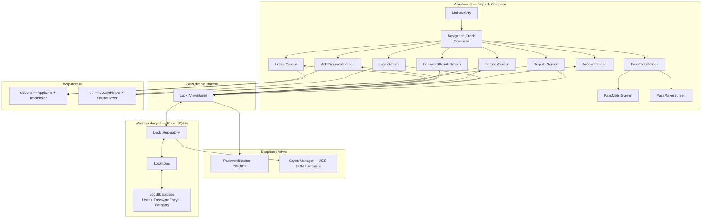
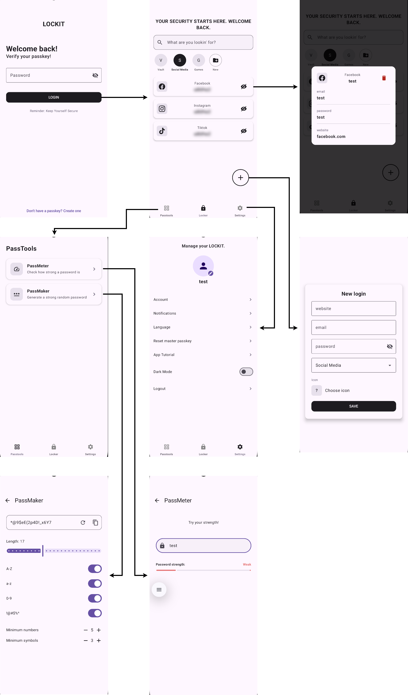
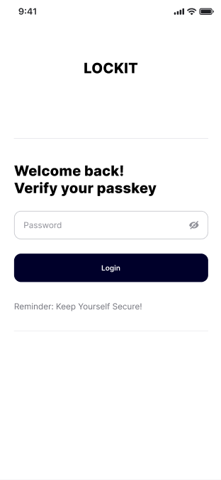
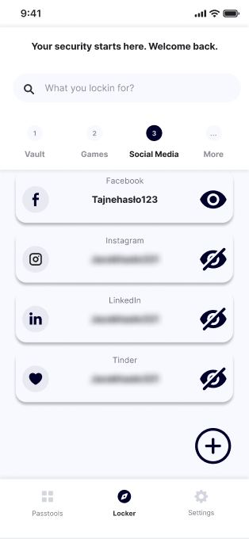
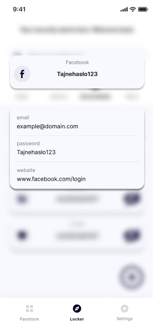
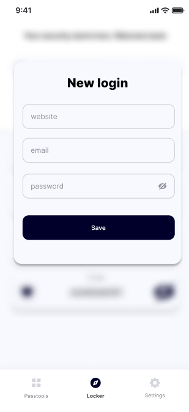
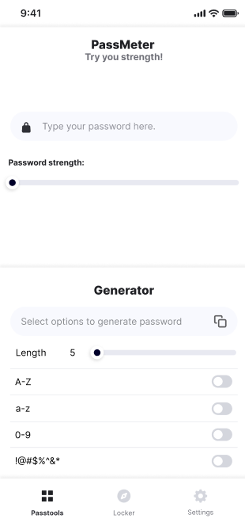
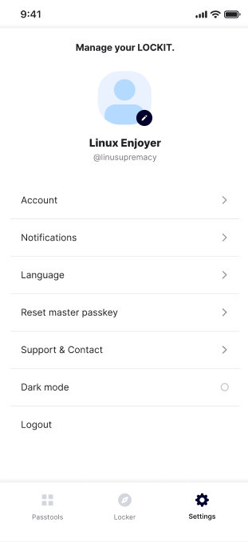
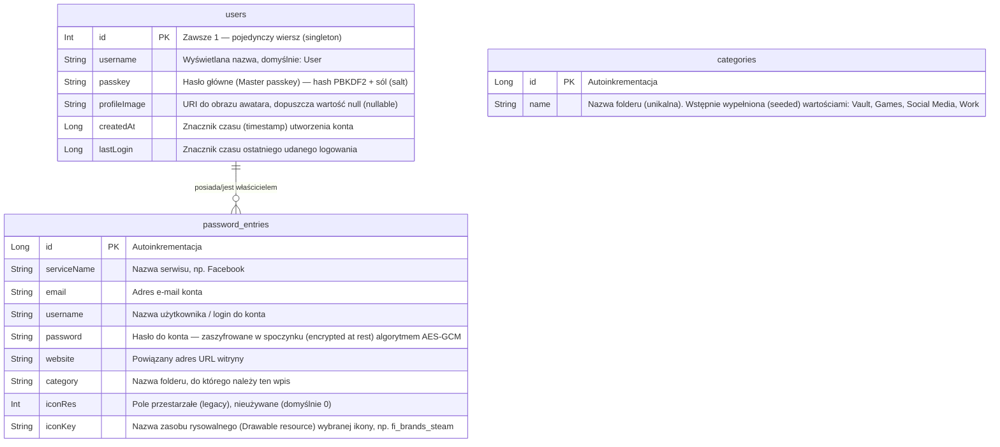

# 🔐 LockIt — Menedżer haseł

[](#)
[](#)
[](#)
[](#)
[](#)

**LockIt** - menedżer haseł dla systemu Android działający w trybie offline. Wszystkie dane uwierzytelniające są przechowywane lokalnie na urządzeniu — bez połączenia z Internetem i bez chmury. Aplikacja została zbudowana przy użyciu Jetpack Compose, biblioteki Room oraz architektury MVVM.

---

## Funkcje

| Funkcja | Opis                                                                                                                              |
| :--- |:----------------------------------------------------------------------------------------------------------------------------------|
| **Bezpieczny Sejf** | Przechowywanie i zarządzanie danymi kont (serwis, e-mail, nazwa użytkownika, hasło, strona internetowa) lokalnie                  |
| **Własne foldery** | Tworzenie, zmiana nazw i usuwanie własnych kategorii; przypisywanie wpisów do folderów (trwale zapisane w Room)                   |
| **Ikony serwisów** | Przypisywanie monochromatycznych ikon marek do dowolnego wpisu poprzez wyszukiwarkę (importowane wektory "Uicons" z Flaticon)     |
| **Zamaskowane hasła** | Hasła na liście są domyślnie zasłonięte; animowany przełącznik pozwala na ich odsłonięcie, a kliknięcie w kartę otwiera szczegóły |
| **Kopiowanie do schowka** | Każdy wpis posiada przycisk szybkiego kopiowania hasła do schowka telefonu                                                        |
| **Informacja dźwiękowa** | Dźwięk odblokowania przy logowaniu / rejestracji                                                                                  |
| **Klucz główny** | Pojedyncze hasło główne chroni dostęp do wszystkich zapisanych wpisów — przechowywane jako hash PBKDF2                            |
| **Szyfrowanie danych** | Zapisane hasła są szyfrowane algorytmem AES-256-GCM (klucz przechowywany w Android Keystore)                                      |
| **Narzędzia haseł** | Miernik siły hasła (`PassMeter`) oraz generator (`PassMaker`) z gwarantowaną minimalną liczbą cyfr/symboli                        |
| **Dynamiczny interfejs** | Pełna obsługa trybu jasnego i ciemnego, przełączana w ustawieniach                                                                |
| **Prywatność przede wszystkim** | Przechowywanie danych w 100% na urządzeniu — brak zapytań sieciowych, brak udostępniania danych                                   |
| **Wielojęzyczność** | Obsługa języka angielskiego i polskiego, przełączalna w czasie rzeczywistym w ustawieniach                                        |
| **Wyszukiwanie na żywo** | Wyszukiwanie w czasie rzeczywistym we wszystkich folderach według nazwy serwisu przy użyciu `Flow`                                |

---

## Architektura systemu

LockIt przestrzega zasad **Clean Architecture** przy użyciu wzorca **MVVM (Model-View-ViewModel)**.



> **Uwaga:** `PasswordDetailsScreen` nadal istnieje jako trasa pełnoekranowa, ale nie jest już osiągalna z poziomu UI — szczegóły wpisu są teraz wyświetlane za pomocą okna popup bezpośrednio w `LockerScreen`.

### Filary architektoniczne

- **Pojedynczy ViewModel** — `LockItViewModel` zarządza stanem dla wszystkich ekranów, unikając nadmiarowych wywołań repozytorium.
- **Strumienie reaktywne** — `Kotlin Flow` i `StateFlow` dla aktualizacji UI w czasie rzeczywistym; wyszukiwanie na żywo przez `flatMapLatest`.
- **Jedno źródło prawdy** — baza danych Room jest jedynym źródłem danych; UI jedynie obserwuje stan.
- **Deklaratywne UI** — 100% Jetpack Compose, brak układów XML.
- **Singleton bazy danych** — `LockItDatabase` używa bezpiecznego wątkowo wzorca singleton z adnotacją `@Volatile`.

---

## Mapa nawigacji

Aplikacja uruchamia się na ekranie **LoginScreen**, który blokuje dostęp za pomocą klucza głównego. Po uwierzytelnieniu użytkownik trafia do **LockerScreen** — centralnego skarbca. Stamtąd pasek nawigacyjny na dole umożliwia stały dostęp do ekranów **PassToolsScreen** i **SettingsScreen**.

<p align="center">
  
</p>

### Przegląd ekranów

| Ekran | Plik | Dostęp z | Opis |
| :--- | :--- | :--- | :--- |
| `LoginScreen` | `LoginScreen.kt` | Uruchomienie aplikacji | Prośba o klucz główny; punkt wejścia przy każdym uruchomieniu. |
| `RegisterScreen` | `RegisterScreen.kt` | `LoginScreen` | Konfiguracja przy pierwszym uruchomieniu — wybór nazwy użytkownika i utworzenie klucza głównego. |
| `LockerScreen` | `LockerScreen.kt` | `LoginScreen` (po uwierzytelnieniu) | Główny skarbiec — kategorie (tworzenie / zmiana nazwy / usuwanie), wyszukiwanie, zamaskowane hasła, przycisk kopiowania, popup ze szczegółami, przycisk dodawania. |
| `AddPasswordScreen` | `AddPasswordScreen.kt` | `LockerScreen` (przycisk +) | Formularz zapisu nowego wpisu — strona, e-mail, hasło, folder docelowy i wyszukiwarka ikon. |
| `PasswordDetailsScreen` | `PasswordDetailsScreen.kt` | _(legacy — brak nawigacji)_ | Widok szczegółów pojedynczego wpisu. Zastąpiony przez okno popup; zachowany jako odniesienie. |
| `PassToolsScreen` | `PassToolsScreen.kt` | Pasek dolny | Centrum narzędzi haseł — odnośniki do PassMeter i PassMaker. |
| `PassMeterScreen` | `PassMeterScreen.kt` | `PassToolsScreen` | Miernik siły hasła z wizualnym wskaźnikiem. |
| `PassMakerScreen` | `PassMakerScreen.kt` | `PassToolsScreen` | Generator haseł z konfiguracją długości, znaków i kopiowaniem do schowka. |
| `SettingsScreen` | `SettingsScreen.kt` | Pasek dolny | Konto, Język, Resetowanie klucza, Tryb ciemny, Wylogowanie. |
| `AccountScreen` | `AccountScreen.kt` | `SettingsScreen` | Podgląd i edycja profilu użytkownika, zmiana zdjęcia profilowego. |
| `AudioPlayerScreen` | `AudioPlayerScreen.kt` | Wewnętrzne | Odtwarzanie dźwięku (Media3 / ExoPlayer). |
| `VideoPlayerScreen` | `VideoPlayerScreen.kt` | Wewnętrzne | Odtwarzanie wideo z akceleracją sprzętową. |

---

## Ekrany

<p align="center">
  
  &nbsp;&nbsp;
  
  &nbsp;&nbsp;
  
</p>

<p align="center">
  
  &nbsp;&nbsp;
  
  &nbsp;&nbsp;
  
</p>

---

## Architektura bazy danych

Aplikacja LockIt wykorzystuje bibliotekę Room Persistence Library (warstwę abstrakcji dla SQLite). Baza danych nosi nazwę lockit_database, jest w wersji 1 i zawiera dwie encje: password_entries oraz users.

### Diagram relacji encji



### Schemat danych — `password_entries`

| Pole          | Typ      | Ograniczenie                | Cel                                                                                                                        |
|:--------------|:---------|:----------------------------|:---------------------------------------------------------------------------------------------------------------------------|
| `id`          | `Long`   | `PRIMARY KEY, autoGenerate` | Unikalny identyfikator wiersza                                                                                             |
| `serviceName` | `String` | `NOT NULL`                  | Nazwa serwisu (używana również do wyszukiwania w czasie rzeczywistym / live search)                                        |
| `email`       | `String` | `NOT NULL`                  | Adres e-mail powiązany z kontem                                                                                          |
| `username`    | `String` | `NOT NULL`                  | Nazwa użytkownika / login do konta                                                                                           |
| `password`    | `String` | `NOT NULL`                  | Hasło do konta — przechowywane w postaci zaszyfrowanej algorytmem AES-256-GCM (klucz kryptograficzny znajduje się w Android Keystore)                                                  |
| `website`     | `String` | `NOT NULL`                  | Adres URL witryny dla danego serwisu                                                                                                |
| `category`    | `String` | `NOT NULL`                  | Folder, do którego przypisany jest ten wpis (musi pasować do wartości w categories.name)                                                             |
| `iconRes`     | `Int`    | `NOT NULL`                  | Pole przestarzałe (legacy), nieużywane — zachowane w celu zapewnienia kompatybilności schematu (domyślnie 0)                                                         |
| `iconKey`     | `String` | `NOT NULL, DEFAULT ''`      | Nazwa zasobu rysowalnego (Drawable) dla wybranej ikony (np. fi_brands_steam); pusty string '' oznacza awatar literowy                                   |

### Schemat danych — `categories`

| Pole | Typ | Ograniczenie | Cel |
| :--- | :--- | :--- | :--- |
| `id` | `Long` | `PRIMARY KEY, autoGenerate` | Unikalny identyfikator wiersza |
| `name` | `String` | `NOT NULL, UNIQUE` | Nazwa folderu; domyślne wartości Vault, Games, Social Media, Work są wprowadzane do bazy (seeded) przy pierwszym uruchomieniu aplikacji |

### Schemat danych — `users`

| Pole | Typ | Ograniczenie | Cel |
| :--- | :--- |:--- | :--- |
| `id` | `Int` | `PRIMARY KEY` | Zawsze 1 — w tabeli zawsze istnieje tylko jeden wiersz użytkownika |
| `username` | `String` | `DEFAULT "User"` | Nazwa wyświetlana (Display name) widoczna na ekranie Ustawień |
| `passkey` | `String` | `NOT NULL` | Hash PBKDF2 + sól (salt) dla głównego hasła (zaczyna się od pbkdf2$...) — nigdy nie jest przechowywane jawnym tekstem (plaintext) |
| `profileImage` | `String?` | `NULLABLE` | Ciąg znaków URI wskazujący na wybrany obraz awatara |
| `createdAt` | `Long` | `NOT NULL` | Znacznik czasu (timestamp) momentu pierwszego utworzenia konta |
| `lastLogin` | `Long` | `NOT NULL` | Znacznik czasu aktualizowany przy każdym udanym logowaniu |

---

## 🧠 ViewModel i Przepływ Danych

LockIt wykorzystuje **jeden współdzielony ViewModel** — `LockItViewModel` — wstrzykiwany za pomocą niestandardowej klasy `ViewModelProvider.Factory`, która buduje łańcuch zależności (`Baza danych → DAO → Repozytorium → ViewModel`) bez użycia frameworka DI (Dependency Injection).

### `LockItViewModel` — Stan i Funkcje (State & Functions)

| Stan / Funkcja | Typ | Opis                                                                                                                                                       |
| :--- | :--- |:-----------------------------------------------------------------------------------------------------------------------------------------------------------|
| `currentUser` | `StateFlow<User?>` | Aktualnie zalogowany użytkownik; `null` gdy nie jest uwierzytelniony                                                                                       |
| `isLoading` | `StateFlow<Boolean>` | `true` dopóki początkowe wyszukiwanie użytkownika się nie zakończy; blokuje ekran startowy, aby ekran Rejestracji nigdy nie mignął przed ekranem Logowania |
| `searchQuery` | `StateFlow<String>` | Aktualny tekst w pasku wyszukiwania                                                                                                                        |
| `passwords` | `StateFlow<List<PasswordEntry>>` | Pełna lub przefiltrowana lista — reaguje na `searchQuery` za pomocą operatora `flatMapLatest`                                                              |
| `categories` | `StateFlow<List<String>>` | Nazwy folderów, obserwowane z tabeli `categories`                                                                                                          |
| `isDarkMode` | `StateFlow<Boolean>` | Aktualny stan motywu; przełączany z poziomu SettingsScreen                                                                                                 |
| `loadUser()` | `private suspend` | Wywoływana w bloku `init`; ładuje użytkownika, aktualizuje `lastLogin` i ponownie szyfruje wszelkie przestarzałe wpisy zapisane jawnym tekstem (plaintext) |
| `registerUser(username, passkey)` | `suspend` | Tworzy nowy wiersz `User` z **zahashowanym** hasłem głównym i ustawia `currentUser`                                                                        |
| `verifyPasskey(input)` | `Boolean` | Weryfikuje wprowadzone hasło główne z zapisanym hashem; przy pierwszym udanym logowaniu w tle aktualizuje przestarzałe hasło zapisane jawnym tekstem       |
| `updateProfileImage(uri)` | `suspend` | Aktualizuje URI awatara użytkownika w bazie danych i stanie (state)                                                                                        |
| `addPassword(entry)` | `suspend` | Wstawia nowy wpis `PasswordEntry` (hasło jest szyfrowane w repozytorium)                                                                                   |
| `deletePassword(entry)` | `suspend` | Usuwa wpis `PasswordEntry` za pośrednictwem repozytorium                                                                                                   |
| `addCategory(name)` | `suspend` | Tworzy nowy folder                                                                                                                                         |
| `renameCategory(old, new)` | `suspend` | Zmienia nazwę folderu i przenosi jego wpisy (scala foldery, jeśli docelowy już istnieje)                                                                   |
| `deleteCategory(name)` | `suspend` | Usuwa folder oraz znajdujące się w nim hasła                                                                                                               |
| `getPasswordCount(name, onResult)` | — | Asynchronicznie zlicza wpisy w folderze (używane przez potwierdzenie usunięcia)                                                                            |
| `updateSearchQuery(query)` | — | Aktualizuje `searchQuery`, co wyzwala `flatMapLatest` do ponownego zapytania do bazy                                                                       |
| `toggleDarkMode(enabled)` | — | Przełącza stan `isDarkMode`                                                                                                                                |
| `resetMasterKey()` | `suspend` | Czyści zmienną `currentUser`, aby wymusić ponowne uwierzytelnienie                                                                                         |

> Kiedy pole wyszukiwania jest **puste**, ekran `LockerScreen` dodatkowo ogranicza listę do wybranego folderu. 
> Gdy tylko użytkownik zacznie pisać, ten filtr folderu zostaje usunięty, więc wyniki wyszukiwania obejmują **każdy** folder.

### Przepływ danych — lista haseł z wyszukiwaniem na żywo (live search)

```text
Użytkownik wpisuje tekst w pasku wyszukiwania
        │
        ▼
updateSearchQuery(query)
        │
        ▼
_searchQuery (MutableStateFlow)
        │
        ▼  flatMapLatest
  query.isBlank?
   ├── TAK → LockItDao.getAllPasswords()      → Flow<List<PasswordEntry>>
   └── NIE → LockItDao.searchPasswords(query) → Flow<List<PasswordEntry>>
        │
        ▼  Repository.map { CryptoManager.decrypt(password) }
        │
        ▼
  passwords (StateFlow) ──► LockerScreen UI (collectAsStateWithLifecycle)
```

LockIt używa biblioteki **Room Persistence Library**. Baza danych nazywa się `lockit_database` (wersja 3) i zawiera trzy encje: `users`, `password_entries` oraz `categories`.

### Przepływ danych — zapytania DAO (`LockItDao`)

| Funkcja | Zwracany typ | Tłumaczenie opisu |
| :--- | :--- | :--- |
| `getUser()` | `suspend User?` | Pobiera pojedynczy wiersz użytkownika (`WHERE id = 1`) |
| `insertUser(user)` | `suspend` | Wstawia lub zastępuje użytkownika (obsługuje zarówno rejestrację, jak i aktualizację profilu) |
| `getAllPasswords()` | `Flow<List<PasswordEntry>>` | Reaktywny strumień wszystkich wpisów — emituje dane przy każdej zmianie w bazie (DB) |
| `getAllPasswordsOnce()` | `suspend List<PasswordEntry>` | Jednorazowy zrzut (snapshot) używany do migracji szyfrowania |
| `insertPassword(entry)` | `suspend` | Wstawia lub zastępuje wpis z hasłem |
| `deletePassword(entry)` | `suspend` | Usuwa określony wpis |
| `getPasswordById(id)` | `suspend PasswordEntry?` | Pobiera pojedynczy wpis na podstawie jego ID |
| `searchPasswords(query)` | `Flow<List<PasswordEntry>>` | Reaktywne wyszukiwanie za pomocą zapytania `serviceName LIKE '%query%'` |
| `getAllCategories()` | `Flow<List<Category>>` | Reaktywny strumień wszystkich folderów |
| `insertCategory(category)` | `suspend` | Dodaje folder (ignorowane w przypadku konfliktu nazw) |
| `renameCategory(old, new)` / `deleteCategoryByName(name)` | `suspend` | Zmienia nazwę / usuwa folder na podstawie nazwy |
| `reassignPasswords(old, new)` / `deletePasswordsByCategory(name)` | `suspend` | Przenosi lub usuwa wpisy z folderu |
| `countPasswordsInCategory(name)` | `suspend Int` | Zlicza wpisy w folderze |

> **Granica szyfrowania (Encryption boundary):** DAO zawsze pracuje na **zaszyfrowanej** wartości `password`. `LockItRepository` to jedyne miejsce, które szyfruje przy zapisie i odszyfrowuje przy odczycie (za pomocą `CryptoManager`), dlatego ani DAO, ani baza danych nigdy nie przechowują danych jawnym tekstem (plaintext).


# Bezpieczeństwo

LockIt przechowuje wszystkie dane lokalnie na urządzeniu. Żadne dane nie są przesyłane przez sieć.

| Aspekt | Implementacja |
| :--- | :--- |
| **Przechowywanie danych (Storage)** | Wszystkie wpisy zapisywane są w bazie danych Room SQLite wyłącznie lokalnie na urządzeniu (on-device only) |
| **Hasło główne (Master passkey)** | Zahashowane za pomocą algorytmu **PBKDF2-HMAC-SHA256** + losowa sól (salt) dla każdego użytkownika (`PasswordHasher`); weryfikowane przy każdym uruchomieniu, nigdy nie jest przechowywane otwartym tekstem (in clear / plaintext) |
| **Szyfrowanie wpisów (Entry encryption)** | Pole `password` jest szyfrowane algorytmem **AES-256-GCM**, a klucz kryptograficzny przechowywany jest w **Android Keystore** (`CryptoManager`) — plik bazy danych (DB) jest bezużyteczny po skopiowaniu go poza urządzenie |
| **Migracja starych danych (Legacy upgrade)** | Istniejące hasła główne zapisane jawnym tekstem (plaintext) są ponownie hashowane przy pierwszym udanym logowaniu; przestarzałe wpisy z jawnym tekstem są szyfrowane na nowo przy uruchomieniu aplikacji |
| **Sesja (Session)** | Stan `currentUser` jest utrzymywany w pamięci (in memory) — czyszczony po wylogowaniu lub wywołaniu funkcji `resetMasterKey()` |
| **Prywatność (Privacy)** | Brak analityki, brak uprawnień sieciowych (network permissions), brak synchronizacji w chmurze |
| **Maskowanie listy (List masking)** | Lista w sejfie nigdy nie renderuje prawdziwego hasła — wyświetlana jest stała, rozmyta atrapa (decoy), dopóki użytkownik nie kliknie, aby odkryć hasło |
| **`lastLogin`** | Aktualizowane w bazie danych (DB) przy każdym udanym uwierzytelnieniu za pośrednictwem funkcji `loadUser()` |

# Zastosowane technologie

| Kategoria | Biblioteka / Narzędzie | Wersja |
| :--- | :--- | :--- |
| Język | Kotlin | 2.1.0 |
| Interfejs użytkownika (UI) | Jetpack Compose | BOM 2026.02.01 |
| Architektura | MVVM (Model-View-ViewModel) | — |
| Baza danych | Room (SQLite) — baza `lockit_database` w wersji v3 | 2.8.4 |
| Bezpieczeństwo | Hasło główne (passkey): PBKDF2-HMAC-SHA256 + Szyfrowanie wpisów: AES-256-GCM za pośrednictwem Android Keystore | — |
| Asynchroniczność (Async) | Coroutines (Koprocedury) + Flow + StateFlow + operator `flatMapLatest` | — |
| Ładowanie obrazów | Coil | 2.7.0 |
| Media (Audio/Wideo) | Media3 / ExoPlayer | 1.10.1 |
| Nawigacja | Compose Navigation (ścieżki / routes zdefiniowane w pliku `Screen.kt`) | 2.9.8 |
| System budowania (Build) | Gradle KTS + Katalog wersji zależności (`libs.versions.toml`) — wtyczka Android Gradle Plugin (AGP) 9.2.1 | — |

---

# Uruchomienie projektu

### Wymagania wstępne
- **Android Studio** Ladybug lub nowsze
- **JDK 17**
- **Android SDK** — `minSdk 24`, `compileSdk`/`targetSdk 36`

### Budowanie

1. Sklonuj repozytorium
```bash
git clone https://github.com/<użytkownik>/LockIt.git
```

2. Otwórz w Android Studio

3. Poczekaj na synchronizację Gradle

4. Uruchom na emulatorze lub urządzeniu


### Pierwsze uruchomienie

Przy pierwszym uruchomieniu aplikacja LockIt przekierowuje na ekran **RegisterScreen**, gdzie tworzysz nazwę użytkownika (username) oraz hasło główne (master passkey). Powoduje to utworzenie w bazie danych pojedynczego wiersza (tzw. singleton) `User` (`id = 1`). Każde kolejne uruchomienie przechodzi przez ekran **LoginScreen**, który odczytuje ten wiersz i weryfikuje wprowadzone hasło.


# Struktura Projektu

```
LockIt/
├── app/
│   └── src/
│       ├── main/
│       │   ├── java/com/example/lockit/
│       │   │   ├── data/
│       │   │   │   ├── local/
│       │   │   │   │   ├── LockItDao.kt           # Wszystkie zapytania Room (interfejs DAO)
│       │   │   │   │   └── LockItDatabase.kt      # Definicja bazy danych Room, migracje, singleton
│       │   │   │   └── LockItRepository.kt        # Warstwa danych + granica szyfrowania (szyfrowanie/odszyfrowywanie)
│       │   │   ├── model/
│       │   │   │   ├── PasswordEntry.kt           # @Entity — tabela: password_entries
│       │   │   │   ├── Category.kt                # @Entity — tabela: categories (foldery)
│       │   │   │   └── User.kt                    # @Entity — tabela: users
│       │   │   ├── security/
│       │   │   │   ├── PasswordHasher.kt          # Hashowanie hasła głównego algorytmem PBKDF2
│       │   │   │   └── CryptoManager.kt           # Szyfrowanie pól algorytmem AES-GCM (Android Keystore)
│       │   │   ├── ui/
│       │   │   │   ├── Screen.kt                  # Stałe ze ścieżkami nawigacji (routes)
│       │   │   │   ├── icons/
│       │   │   │   │   └── AppIcons.kt            # Katalog ikon (wykrywany automatycznie) + IconPicker + ServiceIcon
│       │   │   │   ├── screens/
│       │   │   │   │   ├── LoginScreen.kt
│       │   │   │   │   ├── RegisterScreen.kt
│       │   │   │   │   ├── LockerScreen.kt
│       │   │   │   │   ├── AccountScreen.kt
│       │   │   │   │   ├── AddPasswordScreen.kt
│       │   │   │   │   ├── PasswordDetailsScreen.kt # Przestarzały ekran / legacy (brak nawigacji do niego)
│       │   │   │   │   ├── PassToolsScreen.kt
│       │   │   │   │   ├── PassMakerScreen.kt
│       │   │   │   │   ├── PassMeterScreen.kt
│       │   │   │   │   ├── NotificationsScreen.kt
│       │   │   │   │   ├── AudioPlayerScreen.kt
│       │   │   │   │   ├── VideoPlayerScreen.kt
│       │   │   │   │   └── SettingsScreen.kt
│       │   │   │   └── theme/
│       │   │   │       ├── Color.kt               # Paleta kolorów (Jasny + Ciemny motyw)
│       │   │   │       ├── Theme.kt               # Opakowanie (wrapper) dla MaterialTheme
│       │   │   │       └── Type.kt                # Definicje typografii
│       │   │   ├── util/
│       │   │   │   ├── LocaleHelper.kt            # Przełączanie języka w czasie działania aplikacji (per-app locale)
│       │   │   │   └── SoundPlayer.kt             # Jednorazowe efekty dźwiękowe z folderu res/raw
│       │   │   ├── viewmodel/
│       │   │   │   └── LockItViewModel.kt         # Pojedynczy, współdzielony ViewModel + Factory
│       │   │   └── MainActivity.kt
│       │   └── res/
│       │       ├── drawable/                      # Ikony aplikacji + zaimportowane ikony wektorowe fi_brands_*
│       │       ├── raw/                            # Efekty dźwiękowe (np. unlock.mp3) — opcjonalne
│       │       ├── mipmap-*/                      # Ikony launchera (dla wszystkich gęstości ekranu)
│       │       ├── values/
│       │       │   ├── colors.xml
│       │       │   ├── strings.xml                # Angielskie teksty (strings)
│       │       │   └── themes.xml
│       │       ├── values-pl/
│       │       │   └── strings.xml                # Polskie teksty (strings)
│       │       └── xml/
│       │           ├── backup_rules.xml
│       │           └── data_extraction_rules.xml
│       ├── androidTest/                           # Testy instrumentowane (Android)
│       └── test/                                  # Testy jednostkowe (Unit tests)
├── gradle/
│   └── wrapper/
│       └── libs.versions.toml                     # Katalog wersji zależności (version catalog)
├── build.gradle.kts
├── settings.gradle.kts
└── README.md
```
---

